# 
**Rapport Data Analyse Infrastructure Automation**
 Aangemaakt op 14/11/2022 20:33
## **Inleiding**

Etincidunt aliquam dolorem dolor sit quaerat amet labore. Ut ipsum porro porro amet numquam quaerat. Dolore magnam porro velit. Adipisci dolor neque modi dolor porro. Etincidunt etincidunt ipsum ut ipsum consectetur modi est. Quiquia est voluptatem porro. Voluptatem dolor voluptatem adipisci magnam adipisci. Eius quiquia adipisci velit etincidunt est modi labore. Dolor numquam quiquia est.

Etincidunt quisquam dolor eius quiquia. Est neque dolore dolorem. Quisquam quiquia velit numquam ut. Consectetur velit sed est quiquia magnam ut modi. Neque ipsum amet sed neque porro labore. Sit quaerat quiquia neque velit. Porro quiquia porro ipsum eius dolor consectetur neque. Labore velit porro amet. Dolorem velit etincidunt velit sed adipisci dolorem sed.

Porro dolorem dolor magnam tempora non. Adipisci porro quisquam amet numquam non adipisci etincidunt. Eius dolor voluptatem ipsum adipisci sed. Quaerat est magnam adipisci. Amet sit porro aliquam. Dolor neque dolorem consectetur eius. Sit etincidunt consectetur labore dolore est non. Aliquam consectetur eius sed tempora labore. Aliquam tempora velit est modi ipsum quaerat.

Quiquia numquam dolore consectetur dolorem. Non sit dolorem dolore eius. Dolor numquam sed modi voluptatem modi aliquam aliquam. Velit sed sed etincidunt amet dolor ipsum. Sit numquam labore neque sit. Dolor quiquia etincidunt sed tempora. Amet voluptatem aliquam aliquam voluptatem quisquam quaerat. Etincidunt neque non dolore neque.

Dolorem quaerat magnam non neque. Magnam numquam porro dolor. Numquam sed ipsum velit. Adipisci voluptatem sed dolor velit dolore voluptatem aliquam. Neque neque quaerat quaerat dolorem aliquam. Eius porro quaerat amet neque consectetur dolor quaerat.

Porro quaerat voluptatem etincidunt dolore quisquam porro amet. Quisquam voluptatem porro labore magnam. Adipisci sed eius consectetur adipisci dolore quisquam. Velit ut voluptatem quiquia numquam quiquia non dolor. Ipsum adipisci voluptatem labore sed eius adipisci. Ipsum amet quiquia eius dolor tempora. Tempora etincidunt sit modi voluptatem tempora numquam. Aliquam dolor ut neque quisquam voluptatem est. Dolorem modi porro dolorem neque sed numquam magnam. Consectetur magnam dolor ipsum quaerat.

## **Basisstatistieken**

Langste maximale wachttijd ooit: Oki Doki 220.0 min

Korste maximale wachttijd ooit: Speedy Bob 50.0 min

Kortste gemiddelde wachttijd: El Rio 4.870761670761671 min

Langste gemiddelde wachttijd: Typhoon 16.79262899262899 min

## **Graphieken**

### *De wachttijden van elke attractie doorheen de tijd*
#### Indiana_River.png
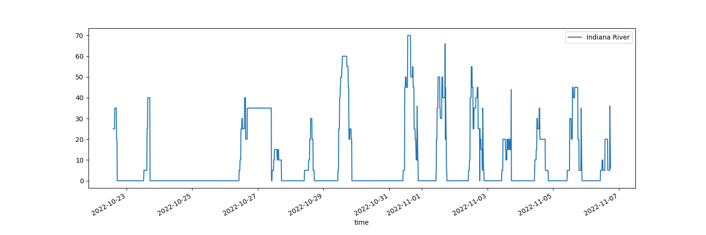
#### Bob_Express.png
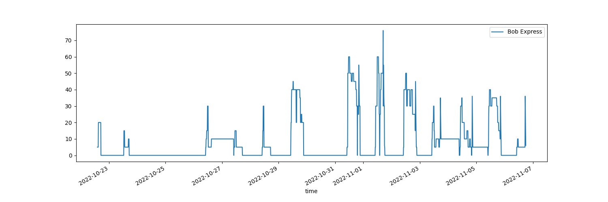
#### Revolution.png
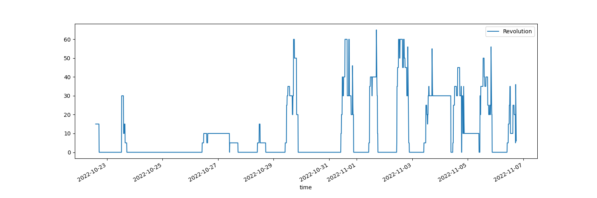
#### Fury.png
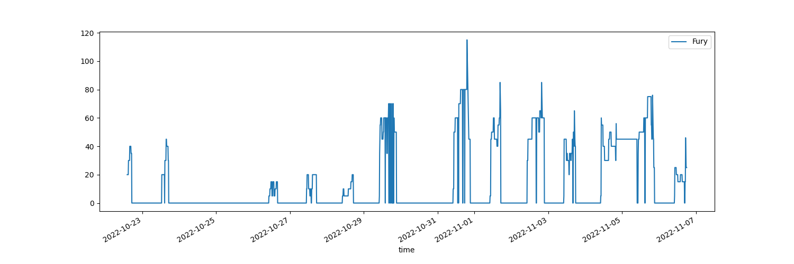
#### Wildwaterbaan.png
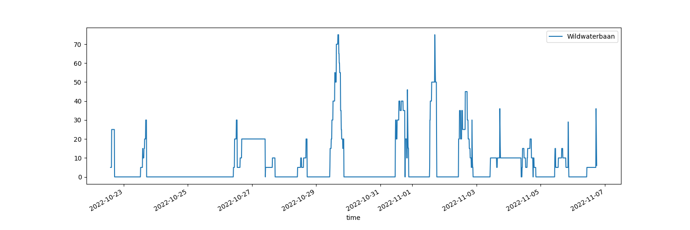
#### Typhoon.png
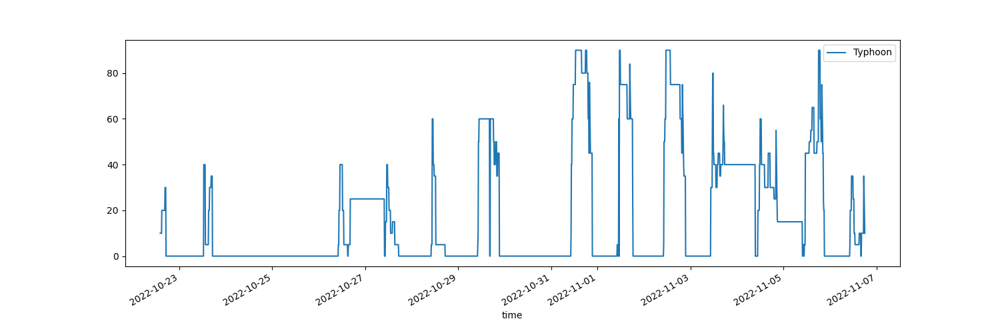
#### Speedy_Bob.png
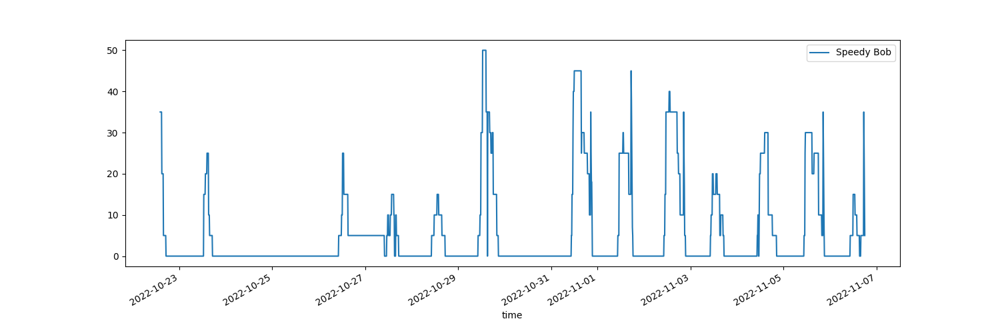
#### Naga_Bay.png
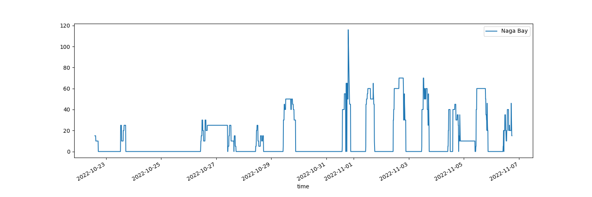
#### The_Dreamcatcher.png
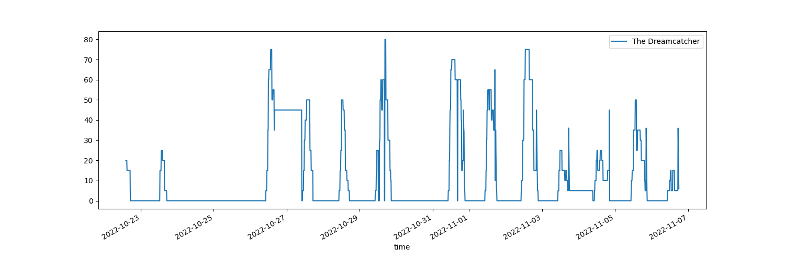
#### Oki_Doki.png
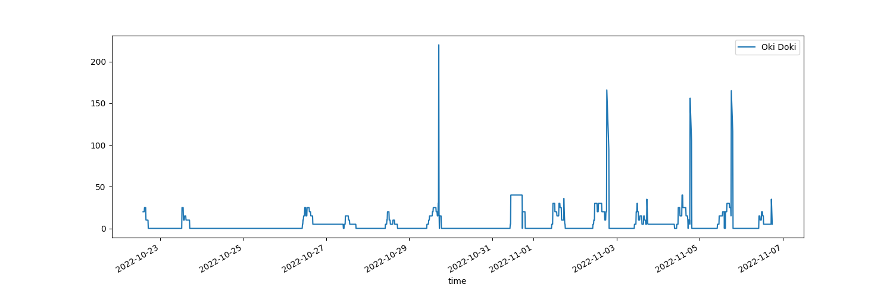
#### El_Rio.png
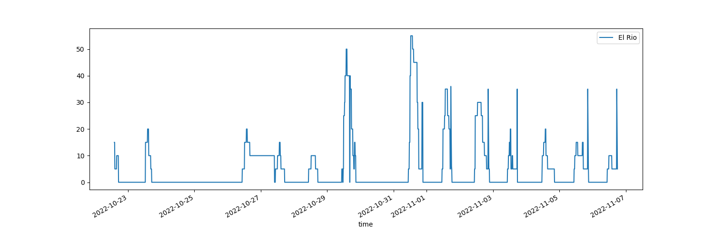
### Aantal keer elke wachttijd voorkomt per attractie
#### El_Rio_wt_count.png
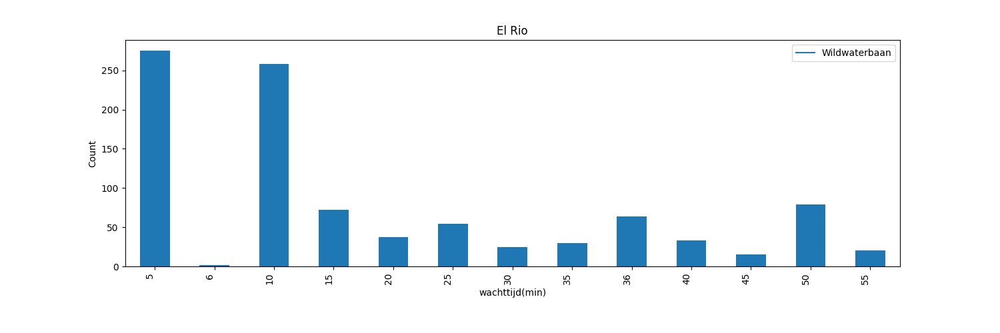
#### The_Dreamcatcher_wt_count.png
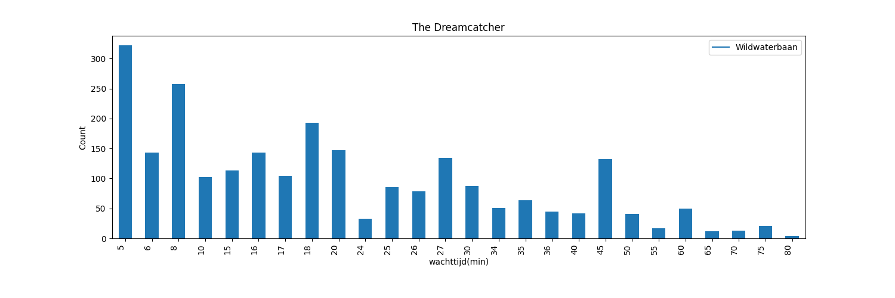
#### Oki_Doki_wt_count.png
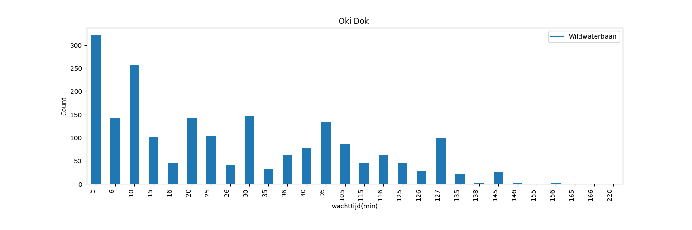
#### Indiana_River_wt_count.png
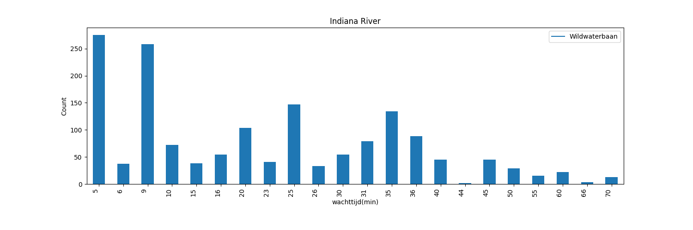
#### Speedy_Bob_wt_count.png
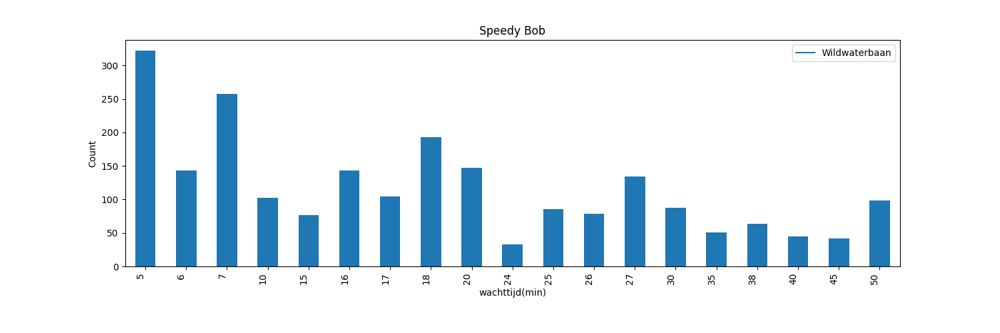
#### Bob_Express_wt_count.png
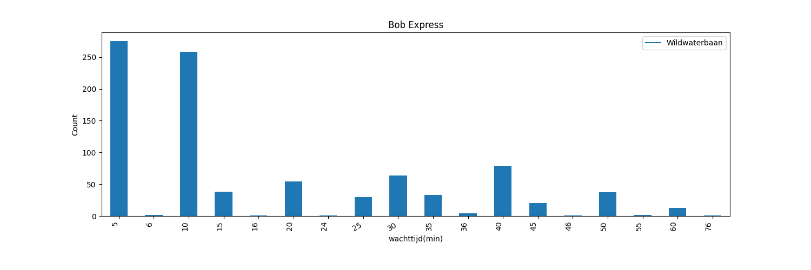
#### Typhoon_wt_count.png
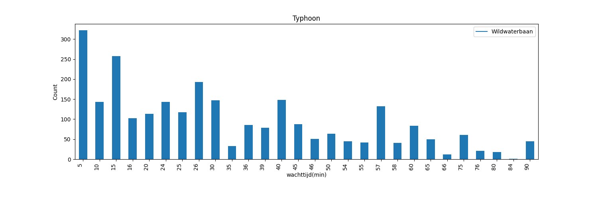
#### Revolution_wt_count.png
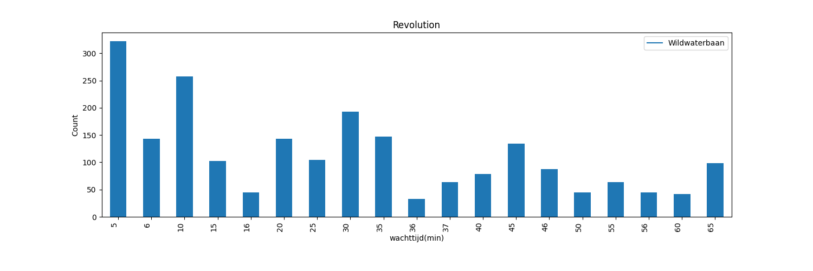
#### Fury_wt_count.png
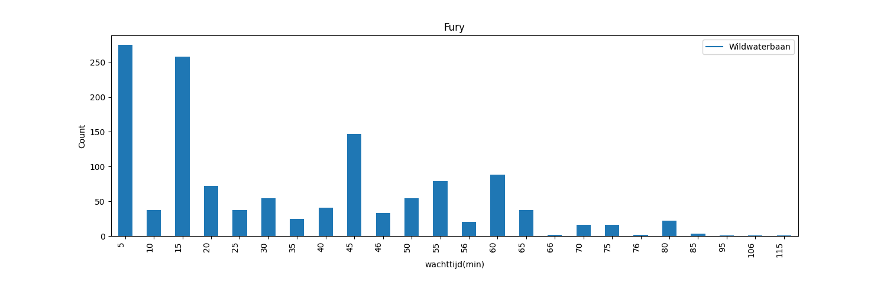
#### Naga_Bay_wt_count.png
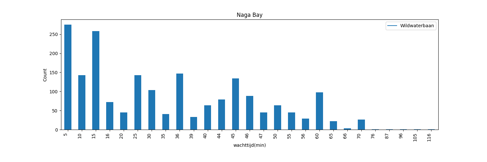
#### Wildwaterbaan_wt_count.png
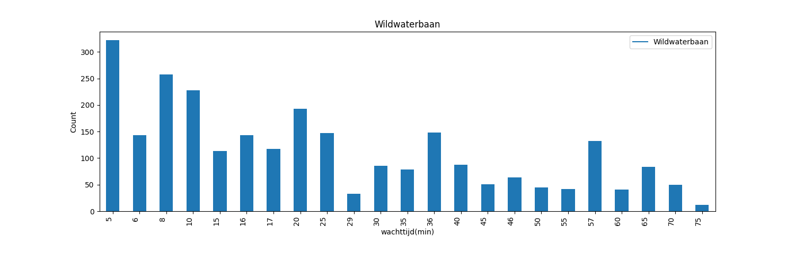
## **Conclusie**
Amet numquam modi tempora voluptatem. Modi quaerat dolorem quisquam adipisci porro quiquia quaerat. Ut tempora aliquam eius magnam. Velit amet non quiquia voluptatem. Neque ipsum est ipsum magnam quaerat dolorem. Dolor dolore aliquam labore magnam. Numquam quisquam numquam tempora numquam aliquam neque voluptatem. Aliquam eius ipsum sit eius quisquam. Modi non sit voluptatem.

Etincidunt tempora eius non porro tempora. Eius ipsum non etincidunt ut magnam dolorem labore. Non quiquia etincidunt labore modi modi quiquia dolorem. Est ipsum consectetur quaerat. Non sit dolor porro. Numquam ipsum porro adipisci.

Dolore modi dolore modi sed tempora. Voluptatem dolor ipsum etincidunt velit eius ut modi. Tempora etincidunt dolor quiquia dolorem etincidunt non. Non ipsum voluptatem porro non. Modi tempora aliquam neque tempora quaerat consectetur labore. Sed modi eius numquam modi.

Neque numquam amet ipsum etincidunt. Quaerat quiquia ipsum quiquia etincidunt ipsum etincidunt modi. Ipsum magnam amet quaerat dolorem ipsum aliquam. Labore aliquam porro porro consectetur porro ut modi. Etincidunt amet neque voluptatem. Amet adipisci labore amet.

Dolorem etincidunt neque dolore. Ut ut sit modi est. Labore non modi magnam quiquia modi porro sed. Numquam quiquia dolorem sit numquam voluptatem sit aliquam. Porro neque modi quiquia dolorem. Est ut voluptatem quaerat quaerat voluptatem numquam.

Adipisci modi quaerat magnam dolore numquam. Modi tempora dolorem dolor consectetur sed. Porro adipisci ipsum modi velit. Modi voluptatem tempora ipsum numquam velit sit dolor. Sed dolore quiquia tempora eius quiquia. Adipisci non etincidunt dolor est labore dolore numquam. Ut non dolorem voluptatem quiquia.