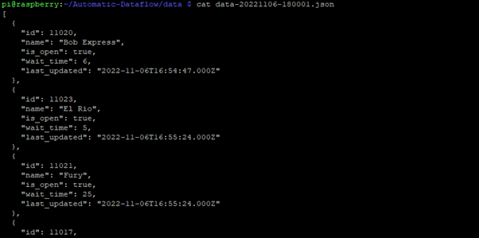
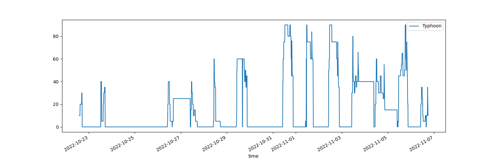
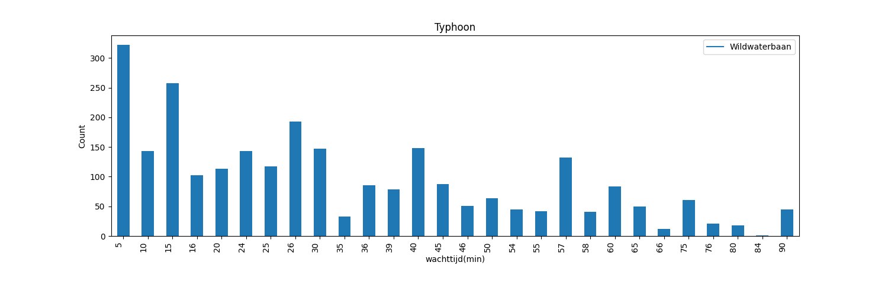

# Automatic Dataflow opdracht
We verzamelen data van een publieke API en gieten die in de juiste vorm om geanalyseerd te worden en om er een rapport over te genereren.

## Data

De publieke API die ik gebruik is een API over de wachttijden van attracties in pretparken in JSON-formaat. We nemen Bobbejaanland als pretpark naar keuze. We gebruiken de URL https://queue-times.com/nl/parks/311/queue_times.json om de wachttijden te verkrijgen. Bobbejaanland heeft als ID 311 om de JSON-data op te halen.

Dit geeft een lijst met verschillende attracties in het pretpark. Elke attractie heeft:

- ID :  `int`
- name : `string` 
- is_open : `boolean`
- wait_time : `int`
- last_updated : `datetime`

Het `wait_time` attribuut is de wachttijd in minuten.

Ik heb dit script laten lopen van **22/10/2022 14:00:01** tot **06/11/2022 18:00:01**. Het heeft 1 dag gecrasht maar ik heb 2036 json-files met ruwe data verzameld tijdens deze periode.

## Scripts

### [**automatisatie_data2rapport.sh**](./Automatic-Dataflow/automatisatie_data2rapport.sh)

> Dit script automatiseert de hele workflow en genereert een rapport in een Markdown-file en op http://localhost:8000. 

1. Eerst zal de data in de [*data*](./Automatic-Dataflow/data/) folder getransformeert worden door [*transform-data.sh*](./Automatic-Dataflow/transform-data.sh)
2. Dan zullen de nodige packages via `pip` en `apt-get` geïnstalleerd worden
3. Hierna zal het de analyse tonen over de data via het [*data_analyse.py*](./Automatic-Dataflow/data_analyse.py) script
4. Uiteindelijk zal het een rapport genereren over de data met het [*generate_rapport.py*](./Automatic-Dataflow/generate_rapport.py) script
5. Als laatste wordt het rapport omgezet naar [*rapport.pdf*](./Automatic-Dataflow/rapport.pdf) en dan toont het het rapport op http://localhost:8000 met het [*setup_pdf_site_rapport.sh*](./Automatic-Dataflow/setup_pdf_site_rapport.sh)

---

### [**get-data.sh**](./Automatic-Dataflow/get-data.sh)

> Dit script scrapt de JSON-data van de API en slaat het op in de [*data*](./Automatic-Dataflow/data) folder. 

De JSON-file heeft als naam het tijdstip dat het gescrapt is. Er wordt ook een [*logfile*](./Automatic-Dataflow/logfile.txt) aangemaakt voor de output van het script. De errorberichten worden ook in een [*logfile_erros*](./Automatic-Dataflow/logfile_errors.txt) opgenomen en naar de console geschreven. Ik startte een crontab via `crontab -e` en voegde `*/10 * * * * path/get-data.sh >> path/logfile.txt 2>&1` helemaal onderaan eraan toe.

---

### [**transform-data.sh**](./Automatic-Dataflow/transform-data.sh)

> Dit script haalt alleen de relevante attributen uit de JSON-files uit de [*data*](./Automatic-Dataflow/data) folder en schrijft ze allemaal naar 1 CSV-file [*data.csv*](./Automatic-Dataflow/data.csv).

In de data dat ik had verzameld zijn er bepaalde kolommen niet nodig, zoals de `id`,`is_open` en `last_updated` kolom. Dus houden we alleen de `name` en `wait_time` kolom bij en het tijdstip.  Ik zet deze data dan in 1 CSV-file [*data.csv*](./Automatic-Dataflow/data.csv). Elke rij toont de wachttijden van elke attractie van Bobbejaanland en de tijd wanneer de wachttijden zijn opgeslaan. De tijd haal ik uit de filename via `basename` en dan doe ik wat operaties de letters en ‘-‘ eruit te halen.

---

### [**data_analyse.py**](./Automatic-Dataflow/data_analyse.py)

> Dit script toont op de console wat informatie over de wachttijden dat we hebben verzameld. Daarna maakt het grafieken aan en steekt die in de [*graphs*](./Automatic-Dataflow/graphs) folder.

Eerst leest het [*data.csv*](./Automatic-Dataflow/data.csv) in en zet alle waarden in een Dataframe. Hierna toont het wat interessante informatie over de data zoals langste/korste maximale wachttijd ooit. Hierna schrijft het die statistieken naar [*statistieken.txt*](./Automatic-Dataflow/statistieken.txt). Dan maakt het 2 soorten grafieken aan voor elke attractie in de [*graphs*](./Automatic-Dataflow/graphs) folder als PNG's. 

1. De eerste soort grafiek is de evolutie van de wachttijd tijdens de periode dat ik scrapte.

2. De tweede soort grafiek toont het aantal keer elke wachttijd voorkomt per attractie. Deze soort grafiek heeft een `_wt_count` in de filenaam.

---

### [**generate_rapport.py**](./Automatic-Dataflow/generate_rapport.py)

> Dit script maakt de Markdown-file [*rapport.md*](./Automatic-Dataflow/rapport.md) aan waar een template van een rapport wordt naar toe geschreven. Hierin staan alle statistieken, grafieken en de datum dat dit script werd uitgevoerd.

Er wordt filler-text gegenereert in de inleiding en conclusie.

---

### [**setup_pdf_site_rapport.sh**](./Automatic-Dataflow/setup_pdf_site_rapport.sh)

> Zet het rapport om naar het PDF-bestand [*rapport.pdf*](./Automatic-Dataflow/rapport.pdf) en start een lokale website op op http://localhost:8000.

Het neemt [*rapport.md*](./Automatic-Dataflow/rapport.md) en zet dit om naar een PDF-bestand [*rapport.pdf*](./Automatic-Dataflow/rapport.pdf) met `md2pdf`. Voor de lokale website gebruikte ik `mkdocs`. Om de website te starten maakt het de [*rapport_site*](./Automatic-Dataflow/rapport_site/) folder en kopieert het [*rapport.md*](./Automatic-Dataflow/rapport.md) en alle grafieken in [*graphs*](./Automatic-Dataflow/graphs/) naar die folder. Daarna kon ik de lokale website starten en vinden op http://localhost:8000.